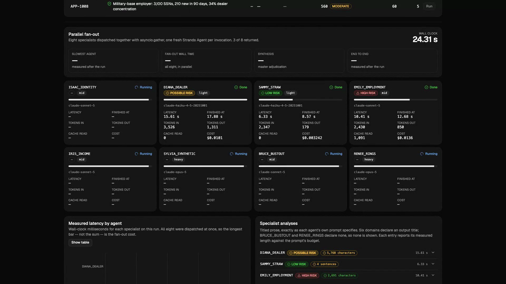

# Multi-Agent Auto-Loan Fraud Underwriting on Amazon Bedrock AgentCore

A 1:1 replacement, on **Amazon Bedrock AgentCore**, of an agentic auto-loan fraud
underwriting platform currently running on Snowflake Intelligence (Cortex Agents):
**eight specialist fraud agents running in parallel, synthesized by a master
underwriting agent**.

Built with the **Strands Agents SDK** on **AgentCore Runtime**, with Claude models
on Amazon Bedrock.

> The point of this repo is fidelity. The customer's engineer wrote the production
> agents; their prompts, risk calibration, and output contracts are reproduced
> byte-for-byte rather than reinterpreted. Where a claim cannot be measured, this
> repo says so instead of estimating.

## What it does

Given an auto-loan application, the system produces an underwriting adjudication —
**APPROVE**, **REVIEW AND APPLY STIPULATIONS**, or **DECLINE** — backed by eight
independent specialist analyses across identity, dealer, straw borrower,
employment, income, synthetic identity, bust-out, and fraud rings.

It also answers targeted analyst questions ("is there income fraud on APP-1003?")
through the interactive router path, which calls at most two specialists per query.

The calibration carried over from the production prompts: **LOW risk is the most
common outcome**. Specialists validate precomputed signals against benign
`_context` (household sharing, employer scale, population density,
self-employment, data quality) before escalating, and **alert volume alone never
drives risk**.

## Fidelity: how the customer's agents are preserved

| Aspect | How it is preserved | Enforced by |
|---|---|---|
| The nine agent prompts | Byte-identical copies in `prompts/verbatim/`, sha256-verified at import | `prompts/loader.py`, `tests/test_prompt_fidelity.py` (215 tests) |
| Agent identities | ISAAC_IDENTITY, DIANA_DEALER, SAMMY_STRAW, EMILY_EMPLOYMENT, IRIS_INCOME, SYLVIA_SYNTHETIC, BRUCE_BUSTOUT, RENEE_RINGS, and Francis for the interactive path | `prompts.loader.AGENT_NAMES` |
| Specialist output shape | Titled prose with the exact title string — and **no title** for bust-out and rings, which the source prompts deliberately omit | contract tests |
| Length discipline | LOW = 3–5 sentences; POSSIBLE/HIGH ≤ 4000 chars; straw with no co-borrower = 2–3 sentences | contract tests |
| Master adjudication | **Exactly 21 keys in the source order**, starting at `master_summary`; no `application_id` key | `agents/contracts.py` + Strands `structured_output_model` |
| Synthesis input order | IDENTITY, DEALER, STRAW, EMPLOYMENT, INCOME, SYNTHETIC, BUSTOUT, RINGS — substituted into the source prompt's own placeholders | `agents/synthesize.py` |
| Semantic-layer governance | The 29 numbered General Rules: **27 enforced as tested code**, 2 prompt-enforced. The ten alert-ID categories (166 IDs) are data, not prose | `signal_layer/rules/` (66 tests), `signal_layer/alert_categories.py` |
| Signal/analysis separation | Signals are precomputed; each specialist receives only its own domain view and has no data tool | `signal_layer/` |

## The eight specialists

| Specialist | Detects | Anti-false-positive rule it must honor |
|---|---|---|
| Identity | SSN sharing, PII mismatch, identity volatility | Multiple alerts from one underlying data point = one signal |
| Dealer | Dealer-*orchestrated* fraud | Default/EPD/consortium scores are **portfolio risk, not fraud** |
| Straw | Proxy/nominee co-borrowers, role-switching | No co-borrower ⇒ straw risk inherently minimal |
| Employment | Fabricated/shell employers | Missing employer fields are a **data gap, not fraud** |
| Income | Overstatement, inconsistent reporting | <15% variance is normal; self-employment explains variance |
| Synthetic | Fabricated identity + manufactured credit | Thin files are legitimate for young adults and new immigrants |
| Bust-out | Rapid velocity, unsustainable exposure | Geography alone must not move classification |
| Rings | Shared identifiers, exact-unit reuse | Multi-unit housing and large employers explain overlap |

## See it run

[](media/demo.mp4)

**▶ [media/demo.mp4](media/demo.mp4)** — a real run against live Bedrock, recorded at
1920x1080. Not a mockup and not a reconstruction: the latencies, token counts and costs
on screen are the ones that run produced.

## Measured, live on Amazon Bedrock

Fixture APP-1004 (synthetic identity + fraud ring), us-east-1, one run:

| | Measured |
|---|---|
| **End to end** | **37.5 s** — the customer's target is under 60 s |
| Fan-out | 31.4 s, vs **157.6 s** if the eight ran sequentially (**5.0x**) |
| Master synthesis | **6.1 s** on GPT-5.6 Luna (55 s on Claude Sonnet 5) |
| Cost per application | **$0.245**, computed from real token usage |
| Output contract | 21 / 21 keys, exact order, validated |
| Specialists | 8 / 8 returned (7-of-8 still adjudicates by design) |

Nothing above is extrapolated. Re-measure with `evals/bench.py`; if it has not been
measured, this repo shows an em dash.

## Where the latency win comes from

The eight specialists run **concurrently** via `asyncio.gather`, each as a fresh
Strands `Agent` on its own configured model, and the master then synthesizes. So
end-to-end is *slowest agent + synthesis*, not the sum.

Per-model latency on the same short fraud prompt (`maxTokens=120`, us-east-1):

| Model | Latency |
|---|---|
| Claude Haiku 4.5 | 1848 ms |
| Claude Sonnet 5 (effort=low) | 2393 ms |
| Claude Opus 5 (effort=low) | 2924 ms |
| Claude Opus 4.8 | 2990 ms |
| Claude Sonnet 4.6 | 4481 ms |

Note that **Sonnet 4.6 is slower than Opus 4.8** — latency does not track price,
so tiering decisions have to be measured rather than assumed.

**What is still unverified:** a p50/p95 across all 14 fixtures and at concurrency. The
37.5 s figure is one measured run on one application, which is enough to show the target
is reachable and not enough to call it a benchmark. Run `evals/bench.py --live` for that.

## Per-agent model configuration

Snowflake Intelligence pins every agent to one LLM. AgentCore lets each agent use
a right-sized model:

| Tier | Model | Agents |
|---|---|---|
| Light | Claude Haiku 4.5 | dealer, straw |
| Mid | Claude Sonnet 5 | identity, employment, income, bustout |
| Heavy | Claude Opus 5 | synthetic, rings |
| Synthesizer | GPT-5.6 Luna (`bedrock-mantle`) | master adjudication |

The synthesizer is the one place a non-Claude model earned its slot on measurement: it
reads all eight narratives (~28K input tokens) and emits the 21-key object. Claude
Sonnet 5 took 55.2 s and $0.117; GPT-5.6 Luna took 6.1 s and $0.015 for the same verdict
and a valid contract — 9x faster, and it is what brings end-to-end under a minute. The
eight specialists stay on Claude: they are the fraud analysis, and no accuracy
measurement justifies moving them. Override with `BEDROCK_MODEL_SYNTHESIZER`.

Every assignment is env-overridable, and `agents/models.py:TIER_RATIONALE` cites
the prompt text justifying each one (for example, straw's own instruction to keep
no-co-borrower analyses to 2–3 sentences).

### An honest note on cost

**The tier *shape* itself saves $0.00.** Haiku→Sonnet is a $2/$10-per-MTok step
down and Sonnet→Opus is the identical step up, so two light agents fund exactly
two heavy agents at equal token counts. This is asserted by a test so nobody
re-introduces the claim.

The cost reductions that survive arithmetic:

| Lever | Effect | Caveat |
|---|---|---|
| `global.*` instead of `us.*` inference profiles | **−9.09%** exactly | Identical API and model behavior |
| Claude Sonnet 5 introductory rate ($2/$10 vs $3/$15) | −20.13% on the modeled profile | **Reverts to $3/$15 on 2026-09-01** |
| Batch inference | −50% | Opus 5 / Sonnet 4.6 / Haiku 4.5 only; mutually exclusive with prompt caching |
| Precomputing signals | Removes 8 Cortex Analyst messages + 8 warehouse executions per application | Requires the signal layer |

**Prompt caching, measured:** the source prompts are 547–956 estimated tokens, and
the minimum cacheable prefix is 512 (Opus 5), 1024 (Sonnet 5 / 4.6, Opus 4.8) or
4096 (Haiku 4.5). Only the two Opus-tier agents cache today; the rest accept the
cache point silently and pay full price. `agents.models.cache_prefix_report()`
reports this per agent rather than implying a discount.

## Two-layer design: signals, then analysis

Matching the production pattern: governed query results are generated **first**,
then handed to the agents for interpretation. The same agent never both queries
and investigates.

- **Signal layer** (`signal_layer/`) — precomputed signals with their paired
  `_context` example rows and `alerts_fired`, plus the General Rules enforced as
  code (lender join and nickname resolution, address-key normalization,
  `application_id AND hash_lender_id` joins, fake-record filtering with the
  null-safe idiom, no-raw-SSN gating, phone equivalence, retro handling, …).
- **Analysis layer** (`agents/`) — the eight specialists and the master
  synthesizer. They interpret; they never write SQL.

Keeping text-to-SQL out of the per-application hot path matters: a published
production decomposition of a Cortex Agent call attributes ~27 s of a 55 s total to
Cortex Analyst SQL generation alone. For a fixed set of fraud signal groups the
queries are known at design time, so there is no reason to regenerate them per
application. See `docs/semantic-layer-mcp.md`.

## Repo layout

```
prompts/verbatim/        byte-identical customer prompts (9) + orchestration docs (9)
prompts/loader.py        sha256-guarded loading; raises on any drift
signal_layer/
  registry.py            every signal: owner domain(s), verbatim thresholds
  schema.py              SignalPayload / DomainView / AlertFinding
  alert_categories.py    the ten alert-ID categories (166 IDs)
  bands.py               fraud-score / dealer-score bands, PRODUCT decode
  rules/                 one module per General Rule + a coverage catalog
agents/
  models.py              tiering, shared Bedrock client, cache guards
  pricing.py             real rate card incl. cache and batch rates
  fanout.py              asyncio.gather over 8 fresh Agents, real usage capture
  contracts.py           Adjudication — 21 required fields, exact order
  synthesize.py          structured-output synthesis off the verbatim prompt
app/underwriter/main.py  AgentCore Runtime entrypoint (streaming SSE)
app/francis/main.py      AgentCore Runtime entrypoint (interactive router)
fixtures/                applications with full signal coverage + alerts_fired
evals/bench.py           the only code allowed to publish latency or cost
ui/                      Vite + React + Tailwind + shadcn/ui demo
agentcore/               agentcore.json + aws-targets.json for the real CLI
deploy/                  deploy guide, IAM policies, CI gate
```

## Quick start (offline, no AWS)

```bash
MOCK_MODE=1 python3 -m pytest tests/ -q
```

## The demo UI

```bash
cd ui && npm install && npm run build && cd ..
MOCK_MODE=1 python3 -m uvicorn ui.server:app --port 8080
# open http://localhost:8080
```

Pick a scenario and run the underwriting. Eight agent cards light up as each
specialist finishes, showing its model, tier, measured latency, real token usage
and cost. Then the adjudication panel renders the 21-key contract with a
validation indicator, alongside the signal-layer view proving each agent saw only
its own domain.

Fields that have not been measured show an em dash. Token and cost fields are
`null` in MOCK_MODE because no model was invoked — the UI states this rather than
displaying a placeholder figure.

## Measured benchmarks

```bash
# orchestration overhead only — no model latency is measured
python3 -m evals.bench --offline --concurrency 1,4,16 --iterations 40

# real Bedrock; requires explicit opt-in and prints estimated spend first
AGENTCORE_BENCH_ALLOW_LIVE=1 python3 -m evals.bench --live --iterations 3
```

`bench.py` records SDK-reported `latencyMs`, wall clock, TTFT, input/output/cache
tokens, cost from the real rate card, and whether each prompt even met the model's
minimum cacheable prefix. It refuses to print percentiles below a documented
minimum sample count, and every report carries the git sha, region, model IDs and
a `caveats` array stating what was not measured.

## Deploy to AgentCore Runtime

**Deploying into your own account: read [`deploy/README.md`](deploy/README.md).** It
is the end-to-end path, verified by execution, and it covers the two failure modes
that cost the most time here: `./deploy/vendor.sh` is mandatory before every deploy
(skip it and a missing module is reported as a 30-second init timeout), and
`MOCK_MODE` defaults to mock (so a runtime with no env block returns a complete,
plausible stream having called Bedrock zero times).

```bash
npm install -g @aws/agentcore          # 1.0.0-preview.22, node >= 20
(cd agentcore/cdk && npm install)      # required: the vended CDK pins its own tsc
./deploy/vendor.sh                     # REQUIRED — vendors the shared packages
agentcore validate --json
agentcore deploy --dry-run
```

Two CloudFront endpoints — the docs site and the live demo — are a second, separate
stack, deployed with one command:

```bash
PYTHON=$(which python3) ./deploy/deploy-sites.sh
```

`agentcore configure` and `agentcore launch` do **not** exist in the current CLI.
The npm CLI rejects them and exits 1, but the deprecated pip
`bedrock-agentcore-starter-toolkit` installs a *different* binary of the same name
on which they parse and then no-op — so a script calling them can deploy nothing
and still report success, depending on which binary is first on `PATH`.
`deploy/ci.sh` greps for both strings and fails if the pip toolkit is installed. Full details, including the
one-time CloudWatch Transaction Search setup for GenAI observability, are in
`deploy/deploy.md`.

## Status and open questions

Current landed state, remaining work, and the questions we owe the customer
(including a real enum conflict between their prompt file and their process guide)
are tracked in **[CLAUDE.md](CLAUDE.md)**. Read it before changing anything — it
documents several measured traps that look like obvious improvements.

## Reference

- AgentCore getting started: https://catalog.workshops.aws/agentcore-getting-started/en-US
- AgentCore deep dive: https://catalog.workshops.aws/agentcore-deep-dive/en-US
- Strands Agents: https://strandsagents.com
- Prototype to production samples: https://github.com/aws-samples/sample-amazon-bedrock-agentcore-prototype-to-production
